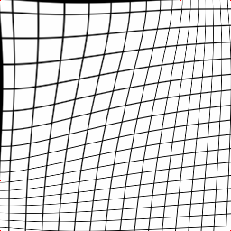

# Thin Plate Spline interpolation for PyTorch

Warps 2d PyTorch image (NxCxHxW) according to sparse 2d control points

## Build

Just copy and paste the code, or run `python setup.py build && python setup.py install`
